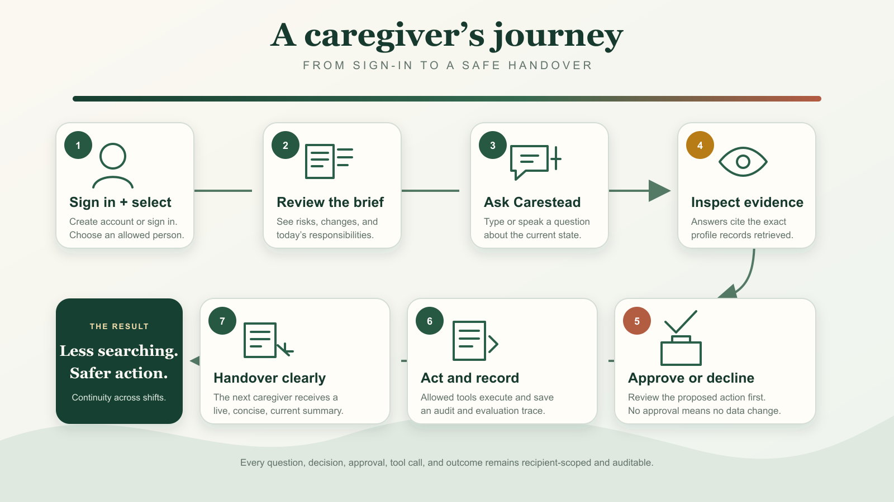
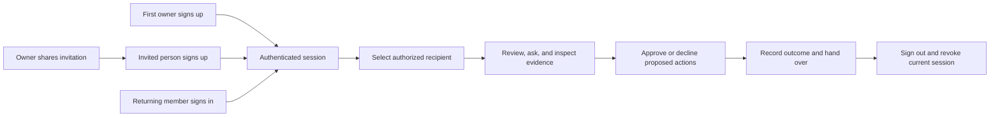

# Carestead

Carestead is a caregiver cognitive-load agent that monitors a changing care plan, identifies coordination risks, proposes constrained actions, and records an evaluation trace for every decision.

## Product capabilities

- Shared responsibilities with owners, deadlines, and completion state
- Explainable risk detection across tasks, timeline events, and trusted facts
- Human approval before consequential actions
- Structured, source-linked memory stored in the application database
- Reviewed chat-to-fact suggestions
- Evaluation traces for evidence, decisions, policy checks, tool use, and outcome
- Synthetic longitudinal demo data for safe testing
- Runnable synthetic benchmark with calculated quality metrics
- Email/password sign-up and sign-in with independent password visibility controls
- Expiring sessions, sign-out, and single-use care-circle invitation links
- Signed-in care-circle roles with server-side authorization
- Full create, view, edit, verify, complete, reassign, and archive workflows
- Multiple care recipients with an explicit recipient switcher and isolated records
- Reusable, versioned care-plan templates with recipient-specific overrides
- Privacy-safe plan cloning and de-identified custom template creation
- Live caregiver handover brief with profile, current state, review priorities, contacts, and support systems
- Approval-aware in-app notifications with held, delivered, and read states
- Consent, retention, recipient export, and verified permanent-deletion controls
- Central input validation, request throttling, health checks, and privacy-safe error monitoring
- Automated WCAG accessibility checks in continuous integration
- Recipient-scoped pop-up chat with grounded answers and expandable evidence
- Approval-gated chat tools for rescheduling, assignments, responsibilities, care checks, and in-app notifications
- Browser voice input and spoken replies without retained audio
- Per-caregiver Google Calendar connections with recipient-specific calendar selection
- Approval-gated calendar invitations, rescheduling, cancellation, and confirmed event links


## Care planning and caregiver relief

Open **Care planning** for break coverage requests, dependency-aware “What if?” simulations, reviewed text/voice updates, availability sharing, and small-task claiming. **Handover** highlights changes since each caregiver’s last acknowledgement. **Memory** groups conflicting care facts for verification and excludes disputed or expired facts from recall.

Coverage is confirmed only when the selected caregiver accepts. Planning uses real member identities, task durations, capabilities, and explicit availability; edits invalidate old acceptance. Required care facts can hold scheduling until they are verified. Proposals preserve source text and are revalidated before execution.

See [the care-planning guide](docs/care-planning.md) for setup, examples, supported extraction syntax, migrations, and tests.

## Architecture

The **Care planning** view also includes a seven-day workload forecast, verified preference-aware visit suggestions, reviewed recurring tasks, appointment preparation briefs, and a personal in-app attention digest. See [Care ahead](docs/care-ahead.md) for behavior, data boundaries, and verification.

The MVP is a Sites/Vinext React application backed by Cloudflare D1. The agent layer is deliberately deterministic for the initial release: it evaluates structured records with testable rules and keeps each result auditable. An LLM reasoning adapter can be introduced later behind explicit consent, redaction, and the same approval policy.


The lightweight RAG layer retrieves relevant tasks, events, and trusted facts directly from the structured care database. Every retrieval is filtered by an authorized `recipient_id`, giving the orchestrator grounded context without introducing a separate vector service for the MVP.

The browser experience includes sign-up and sign-in pages. Authentication endpoints validate credentials and issue an HttpOnly session cookie; care APIs resolve that session to an active member and check recipient access before returning data. Account, session, and invitation records live in D1 alongside the care data.

The browser experience, authenticated API boundary, agent orchestration, retrieval, approval policy, tools, durable data, and evaluation loop are shown together above. Questions can return grounded answers immediately; action requests become typed proposals and cross the approval gate before any tool is allowed to write.

## Key components

| Component | Responsibility |
| --- | --- |
| Account pages and sessions | Shared sign-up/sign-in forms, password visibility controls, hashed passwords, expiring cookies, and sign-out |
| Invitation enrollment | Owners issue or renew single-use links; matching-email sign-up activates recipient-scoped membership |
| Caregiver dashboard | Presents risks, responsibilities, timeline events, memories, approvals, care-circle roles, and benchmark results |
| State API | Loads the care plan and validates every requested mutation |
| Agent orchestrator | Coordinates retrieval, deterministic risk evaluation, approval policy, and trace recording |
| Lightweight RAG | Selects structured tasks, events, and trusted facts as grounded context; no separate vector service is required |
| Responsibility tools | Create, edit, assign, complete, and archive care tasks |
| Memory tools | Create, edit, verify, and archive source-linked trusted facts |
| Approval gate | Prevents consequential recommendations from becoming actions without caregiver review |
| D1 database | Stores operational state, care-circle membership, audit records, and evaluation traces |
| Recipient access boundary | Links each signed-in member to only the people they may access and assigns a per-recipient role |
| Plan template manager | Instantiates built-in plans, records personal overrides, saves de-identified templates, clones structure, and applies opt-in upgrades |
| Caregiver handover | Consolidates the recipient profile, latest event, unresolved risks, pending reviews, upcoming responsibilities, support contacts, and authorized care team |
| Policy guardrails | Applies validation, authorization, consent status, throttling, approval policy, auditing, and privacy-safe error handling before actions |
| Carestead chat | Saves a separate caregiver conversation for each recipient, retrieves only authorized profile records, exposes evidence, and turns action requests into reviewable proposals |
| Voice controls | Uses supported browser speech recognition and speech synthesis; only the resulting text enters chat history and raw audio is not stored |

The current release uses one care-state agent, not a multi-agent system. Its decision engine is intentionally deterministic so every rule can be tested against known outcomes. A future LLM adapter can assist with reasoning while remaining behind the same retrieval, policy, and approval controls.

## Caregiver user journey

A first-time owner creates an account; other new caregivers join through an owner-issued invitation link. Returning users sign in, then select an authorized care recipient. A caregiver reviews the current state, asks a grounded question by text or voice, inspects the retrieved evidence, and explicitly approves or declines any consequential action. The resulting change and outcome remain visible to the next caregiver through the live handover and audit trail.





See the [account and invitation flow](docs/authentication.md#invite-another-person) for enrollment checks and failure paths.

## Care-recipient and reusable-plan model

Each person has a durable care-recipient record and one active care plan. A plan points to a template key and version; edits to instantiated responsibilities are preserved as recipient-specific overrides. The product includes four starting points:

- Aging at Home
- Medication Support
- Post-Discharge: 30 Days
- Mobility & Physiotherapy

Creating a recipient instantiates fresh responsibilities from the latest selected template. Template upgrades are never automatic: the owner reviews and applies them, new responsibilities are added, and existing personal edits are not overwritten.

“Save as template” creates a reusable custom template from active responsibility structure. Person names are replaced and medication-specific responsibility text is normalized. “Clone plan” creates a new recipient with fresh, unassigned responsibilities. Neither operation copies memories, events, risks, approvals, traces, outcomes, or care-circle membership.

Operational tables remain compact and are connected to a person and plan through `record_scopes`. This provides one authorization and retrieval boundary across tasks, events, memory, risks, approvals, and agent traces.

## Caregiver handover brief

The **Handover** view is a live operational summary for moving responsibility from one caregiver to another. It combines:

- a concise profile, pronouns, home base, care context, communication preferences, mobility/access notes, and urgent-situation plan;
- the newest care event and its source;
- unresolved risks, pending approvals, facts requiring verification, and the next open responsibilities;
- key people, providers, and support services with phone/email details, priority, and operational notes; and
- the care-circle members who currently have access and their role.

Caregivers can copy the brief as plain text for a controlled handover, edit the profile, and create, edit, or archive support contacts. The brief is assembled from current recipient-scoped data whenever it loads, so it does not become a disconnected summary that silently goes stale. It remains a care-coordination aid rather than a medical record or source of clinical guidance.

## Privacy and production-readiness controls

### Approval-aware notifications

The notification inbox is recipient-scoped. Notifications linked to a consequential action begin in `needs_approval`; approving the associated plan releases them to `delivered`. Notifications from ordinary care checks are delivered in-app and can be marked read. The `send_notification` chat tool supports targeted in-app, Resend email, Twilio SMS, and Web Push delivery after explicit caregiver approval and recipient channel opt-in. Read state is tracked per caregiver; provider acceptance is distinct from confirmed delivery. See [notification setup](notification-setup.md) for credentials, supported commands, and current delivery limits. The optional Google Calendar integration sends the appointment details and guest updates explicitly approved by a caregiver.

### Recipient chat, tools, and voice

The floating **Ask Carestead** window is bound to the currently selected recipient. It answers from that person’s profile, responsibilities, timeline, risks, trusted facts, support contacts, and agent traces, and presents the exact records used under an expandable evidence section. Conversation history is stored in D1 per recipient and signed-in care-circle member.

Chat requests to reschedule an appointment, assign transportation, add a responsibility, run a care check, or post a notification create a pending action card. No write occurs until an authorized owner or caregiver selects **Approve**. Execution rechecks recipient access, updates the relevant records, and saves an evaluation trace and audit entry. Chat notification tools can use the configured channels after the addressed caregiver opts in. Google-linked appointments must be changed through the Calendar view so the caregiver reviews the external guest notifications. Email, SMS and Web Push require the runtime configuration described in [notification setup](notification-setup.md).

Voice input uses the browser’s available speech-recognition capability and spoken replies use browser speech synthesis. The transcript follows the recipient’s consent, retention, export, and deletion rules. Raw microphone audio is not saved, and typed input remains available when browser voice recognition is unavailable.

### Google Calendar appointments

The **Calendar** view uses the existing Carestead design system. Each caregiver connects their own Google account, selects an owned calendar for the current care recipient, and prepares an appointment with explicit times, time zone, guests, location, and an organizer reminder. A review card shows the exact external details before **Approve and send invite** calls Google. Rescheduling and cancellation use the same approval policy and notify guests only after approval.

Confirmed actions update the linked responsibility and recipient timeline, record an evaluation trace, and display a Google Calendar link. Stable event IDs, atomic action claims, and provider reconciliation prevent duplicate invitations on retries; ETags protect against overwriting Google edits. Credentials are encrypted and excluded from recipient exports. Gmail inbox access, background synchronization, and recurrence are not included in this milestone.

Google Cloud OAuth credentials and a token-encryption key must be configured before a real account can connect. See [Google Calendar setup and operating behavior](google-calendar-setup.md).

### Consent and retention

Each recipient has a purpose-limited consent record with active/withdrawn status, granting identity and timestamps, and a selected 30-, 90-, 365-day, or no-expiry retention period. Withdrawing consent pauses care-record mutations, chat/voice, agent checks, and new notifications while still allowing the owner to restore consent or delete the data. The retention policy removes expired event, trace, notification, chat, chat-action, and error history during recipient-state loading.

### Export and deletion

Owners can download a recipient-scoped JSON export with a versioned schema and `no-store` response policy. The export contains the profile, contacts, care team, plans, responsibilities, events, memories, risks, approvals, traces, notifications, chat history, chat actions, and consent record. Export requests are logged and rate-limited.

Permanent deletion requires the exact recipient display name, cannot delete the owner’s only remaining recipient, and removes the recipient profile, support contacts, plan, scoped operational records, notifications, chat history/actions, consent, and access mappings. A minimal content-free deletion receipt remains for accountability.

### Validation, throttling, and monitoring

Care-record mutations pass authentication, per-recipient authorization, action-specific throttling, bounded field validation, format checks, consent policy, and audit recording. Error responses include a request identifier. Monitoring stores route, action, error code, actor identifier, recipient identifier, and timestamp—never care notes, memory values, contact details, or profile text. `/api/health` exposes only service and database reachability.

### Accessibility and non-clinical scope

Playwright and axe-core tests cover Sign in, Sign up, Overview, recipient chat, Handover, and Privacy & Data surfaces against WCAG A/AA rules. A browser workflow test also verifies that chat retrieves evidence, proposes a reschedule without changing data, and executes only after approval. GitHub Actions runs these checks on pushes and pull requests:

```bash
cd web
npm run test:accessibility
```

The browser suite starts a separate server on port 43179 with an ephemeral D1 database, creates a test owner through sign-up, and checks authentication, password visibility, invitations, permissions, chat, and accessibility. It does not reuse the development database.

A persistent product footer, onboarding consent acknowledgement, approval guidance, handover notice, export notice, and privacy controls state that Carestead supports coordination only. It does not diagnose, prescribe, replace clinical judgment, or replace emergency services.

## Agent decision path

The agent retrieves relevant records, checks whether the evidence is sufficient, evaluates risk, and routes consequential actions through a caregiver approval gate. Each path ends in a recorded, scoreable outcome.


## Responsibility and memory lifecycle

Caregivers can create, inspect, edit, and archive responsibilities. Responsibilities may also be reassigned, scheduled, marked due soon, completed, or reopened through editing.

Long-term memory uses explicit source-linked records. Chat can suggest a fact from a “Remember that…” request or a simple preference statement; caregiver approval confirms the exact wording and shares it with the selected recipient’s care circle. Approved chat facts are verified immediately. Facts entered through the manual form begin in `review_due`, can be verified by a caregiver, corrected when inaccurate, and archived when obsolete. Archiving keeps the audit history while preventing the record from being used as active context.

## Authentication and authorization

The [authentication guide](docs/authentication.md) documents account setup, invitation and request diagrams, API payloads, session storage, troubleshooting, and migration limits.

Carestead uses email/password accounts and server-side sessions. Open `/sign-up` to create the first care-circle owner, or `/sign-in` to return to an existing account. Passwords must be 12–128 characters; both password fields have an eye button to show or hide their contents. The pages reuse the dashboard’s theme tokens, typography, and UI components.

The first account owns this deployment’s shared care circle. Subsequent accounts require an invitation:

1. An owner opens **Care circle → Invite member**, enters the person’s name and email, and selects Caregiver or Viewer.
2. Carestead creates a single-use link valid for seven days. Copy it and share it privately; the app does not send email.
3. The invited person opens the link and signs up using the invited email address. The invitation grants only the assigned recipient access and role.
4. Owners can select **New invite link** for a pending member to replace a lost or expired link.

Passwords are stored as salted scrypt hashes. Session cookies are HttpOnly, SameSite=Lax, Secure over HTTPS, and expire after seven days; only token hashes are stored in D1. **Sign out** invalidates the session on the server. Authentication attempts are throttled by email and client IP, and browser mutations require a matching Origin header. API clients must send the application’s origin and a valid session cookie.

Automatic localhost identity and implicit trust in `oai-authenticated-user-*` / `x-carestead-test-user-*` headers have been removed. When a development database has the old `local-demo-owner` as its only activated identity, the first localhost sign-up replaces that synthetic identity while retaining its records. Other existing members are never claimed by matching an email alone. Existing deployments that used Site identities need an administrator-assisted account migration before switching to this version; fresh databases work immediately. Password reset and email delivery are not included.

Roles are assigned per care recipient and enforced in every API write path:

- **Owner:** manages members and roles and can change all care records.
- **Caregiver:** can manage responsibilities, memories, approvals, and agent checks.
- **Viewer:** can inspect the care plan and evidence but cannot change records.

Care-record mutations are attributed to the signed-in user in `audit_entries`. Client-side button visibility is only a usability feature; the API remains the authorization boundary.

## Benchmark and evaluation

The checked-in benchmark contains 16 synthetic scenarios across medication, transportation, appointments, check-ins, household needs, memory quality, and robustness. Each scenario supplies tasks, events, memories, and ground-truth labels for expected evidence, severity, approval policy, and action class.

Run it with:

```bash
cd web
npm run benchmark
```

The Evaluations view runs the same benchmark and displays calculated retrieval, decision, policy, and action scores. Version 1 deliberately includes hard cases the baseline agent does not solve, making failures visible for regression-driven improvement.

Benchmark files are in `web/benchmark/`:

- `scenarios.json` — machine-readable scenarios and ground truth
- `schema.json` — benchmark record contract
- `report.mjs` — command-line scorer
- `README.md` — methodology and limitations

## Data model

| Table | Purpose |
| --- | --- |
| `tasks` | Responsibilities, owners, deadlines, categories, and status |
| `events` | Timestamped source activity and agent actions |
| `memories` | Trusted facts with source, confidence, and review state |
| `risks` | Detected coordination risks and proposed actions |
| `approvals` | Human decisions for consequential recommendations |
| `traces` | Trigger, evidence, decision, policy, tool, and outcome |
| `households` | Care-plan container |
| `auth_accounts` | Unique email/password accounts and salted password hashes |
| `auth_sessions` | Hashed session tokens, account links, and seven-day expiry |
| `auth_invitations` | Hashed single-use enrollment tokens and seven-day expiry |
| `care_circle_members` | Signed-in identities, invitations, and roles |
| `audit_entries` | Attributed record-change history |
| `care_recipients` | The people receiving care and their timezone/status |
| `care_plans` | Active plan, source template key/version, and lifecycle |
| `plan_templates` | Built-in and de-identified custom template versions |
| `template_responsibilities` | Portable responsibility definitions and due offsets |
| `template_risk_rules` | Portable detection and approval expectations |
| `record_scopes` | Recipient/plan ownership for every operational record |
| `recipient_members` | Per-recipient access and owner/caregiver/viewer role |
| `plan_overrides` | Recipient-specific responsibility edits preserved across upgrades |
| `recipient_profiles` | Concise caregiver-entered handover context and urgent-plan guidance |
| `support_contacts` | Recipient-scoped people, providers, and support services |
| `consent_records` | Purpose, consent status, grant/withdrawal timestamps, and retention choice |
| `notifications` | Approval-aware in-app notices |
| `notification_preferences` | Per-caregiver channel opt-in and push subscription |
| `notification_deliveries` | Durable tool execution claims and provider outcomes |
| `notification_reads` | Per-caregiver read receipts |
| `data_requests` | Export and content-free deletion accountability records |
| `rate_limit_events` | Short-lived counters for per-user action throttling |
| `error_events` | Privacy-safe request/error metadata for operational monitoring |
| `chat_threads` | One durable recipient/member conversation boundary |
| `chat_messages` | User/assistant transcripts, grounded evidence, and linked action cards |
| `chat_action_requests` | Proposed tools, validated payloads, approval state, and execution timestamps |

## Supported API actions

| Authentication route | Purpose |
| --- | --- |
| `POST /api/auth/sign-up` | Create the first owner or enroll with a valid invitation; issue a session |
| `POST /api/auth/sign-in` | Validate credentials and active membership; issue a session |
| `GET /api/auth/session` | Return the current account identity or `401` |
| `POST /api/auth/sign-out` | Revoke the current session and clear its cookie |

Owner-only `invite_member` and `renew_invitation` actions on `/api/state` return enrollment links for pending members. See the [API reference](docs/authentication.md#api-reference) for fields, cookie/Origin requirements, and error responses.

The `/api/state` endpoint exposes authenticated, validated, rate-limited, recipient-scoped reads and actions for responsibilities, memories, profiles, contacts, consent, notifications, approvals, agent checks, care-circle membership, plan templates, cloning, upgrades, and verified deletion. `/api/chat` retrieves grounded recipient context, saves conversation history, proposes typed tools, and executes approved actions. `/api/export` produces an owner-only recipient export. `/api/health` returns a non-sensitive availability check.

## Run locally

```bash
cd web
npm install
npm run dev
```

Open the URL printed by the development server, then choose **Create an account**. Returning users use `/sign-in`; subsequent new accounts use a link shared from **Care circle → Invite member**. There is no automatic demo login. The application creates and seeds its D1 tables on first use. To create a checked-in SQL migration after schema changes, run `npm run db:generate`.

Both `npm run dev` and `npm run start` keep local accounts and care data in `web/.wrangler/state`, outside the generated build directory, so rebuilding and restarting preserve them. Keep this directory when cleaning build output. Docker uses its own persistent `carestead-data` volume; cloud deployments use remote D1.

## Containers and cloud deployment

Run `make up` at the repository root to build and start the Docker preview at
https://carestead.com:8083 with persistent local D1 storage. `make down` stops it while
keeping data. `make help` lists development, build, test, and deployment commands.

`npm run dev`, `npm run start` (after building), `make dev`, and Docker all use
HTTPS port 8083, with HTTP port 8080 redirecting to HTTPS. Only one preview can
run at a time; occupied ports cause an error instead of switching ports. When
either `web/.certs/carestead.pem` or `web/.certs/carestead-key.pem` is missing,
the preview falls back to HTTP on port 8080 only. Docker mounts the certificate
directory read-only. Restart `npm run dev` or `make dev` to pick up startup
changes. For `npm run start`, run `npm run build` first; for Docker, run `make up`
to rebuild and recreate the container while preserving its data volume.

Use `carestead.com` as the browser hostname in every local mode. It must map to
`127.0.0.1` in your computer's `/etc/hosts` (`127.0.0.1 carestead.com`);
`make host-config` from the repository root sets this up if needed. npm preview
and Docker listen on local IP addresses behind this alias; no public DNS change
is needed. Use `https://carestead.com:8083`, or `http://carestead.com:8080` when
certificates are absent.

Production targets Cloudflare Workers + D1. See [deployment instructions](docs/deployment.md)
for database provisioning, secrets, migration commands, and the manual GitHub deployment workflow.
For the shortest setup, run `make cloud-login`, `make cloud-db-create`, copy
`web/.env.cloudflare.example` to `web/.env.cloudflare`, fill in the database UUID,
then run `make cloud-release`. Local runtime secrets belong in `web/.dev.vars`;
cloud runtime secrets belong in `web/.secrets.cloudflare` and are uploaded with
`make cloud-secrets-apply`. Both have blank `.example` templates. The only Docker
configuration is `Dockerfile.local` with `compose.local.yaml`; `make up` loads the
shared local credentials file automatically.

## Safety scope

This is a care-coordination prototype, not a clinical decision system. It does not diagnose, prescribe, or independently contact people or providers. High-impact actions require caregiver approval and remain visible in the event and evaluation history.
