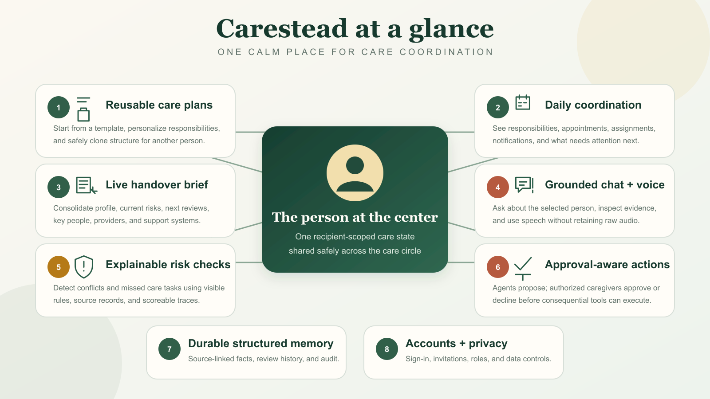
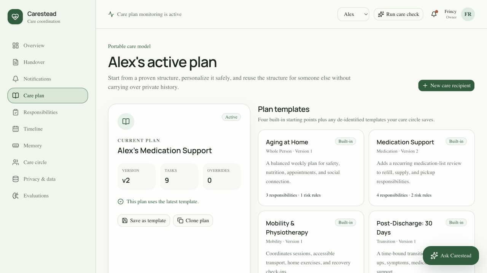
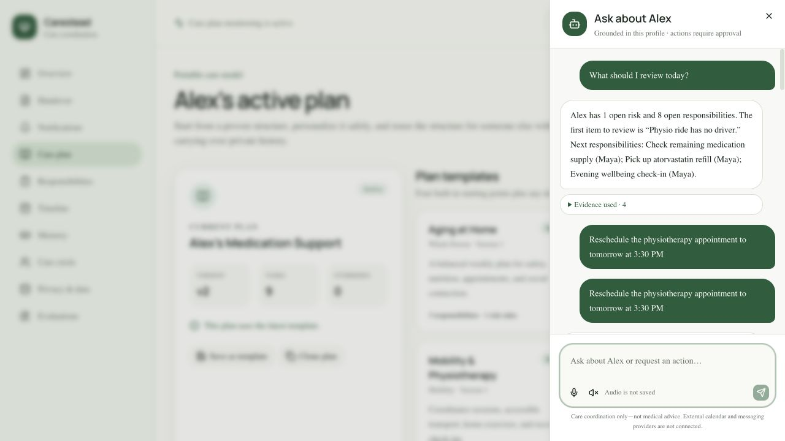
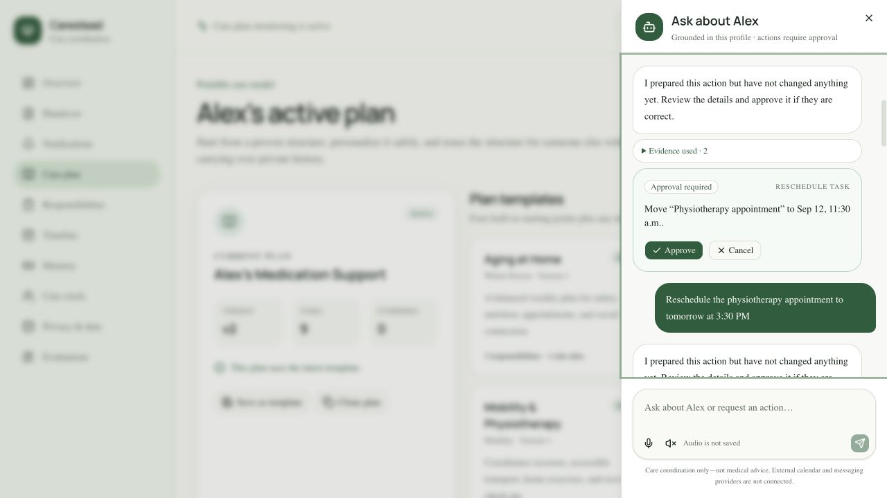
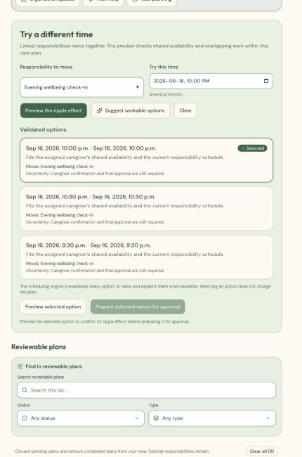
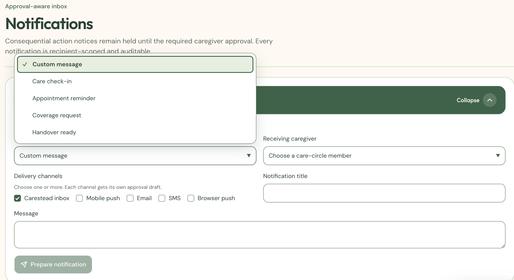
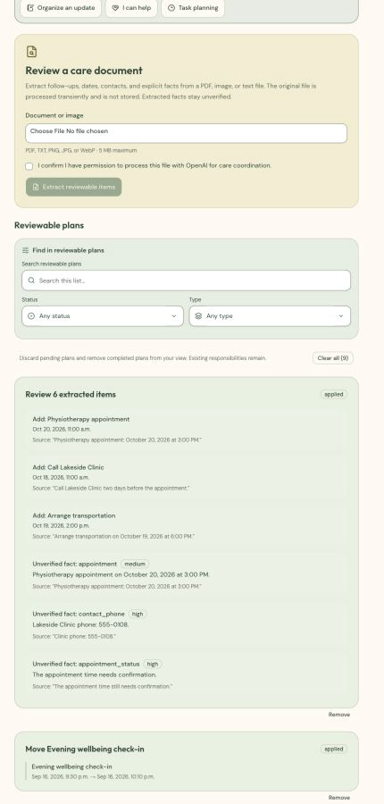
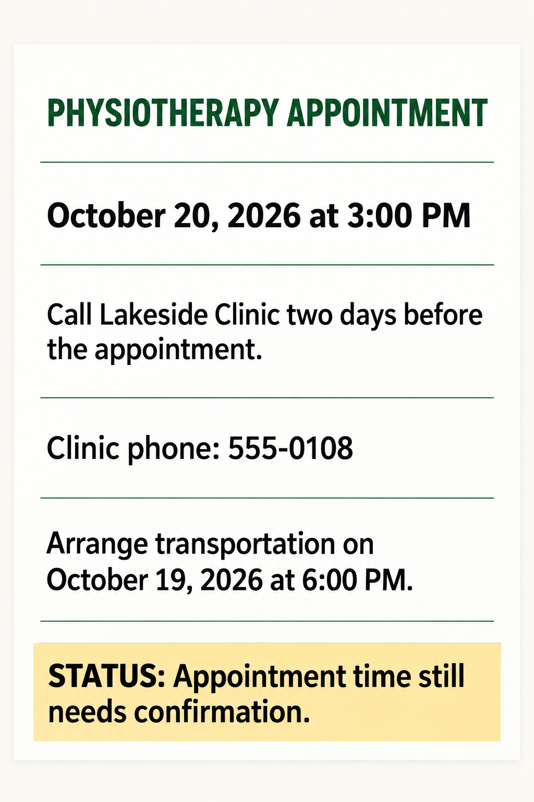
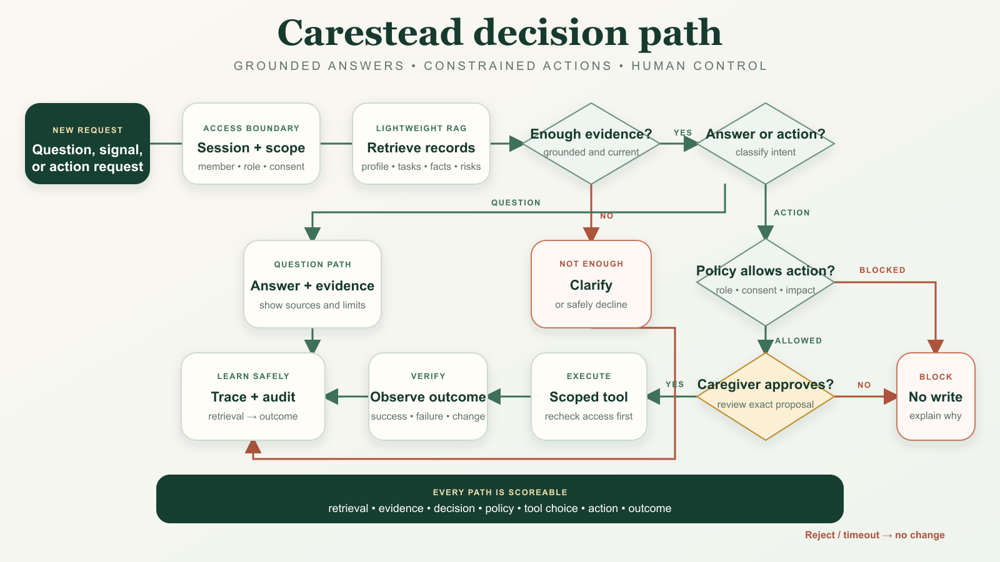
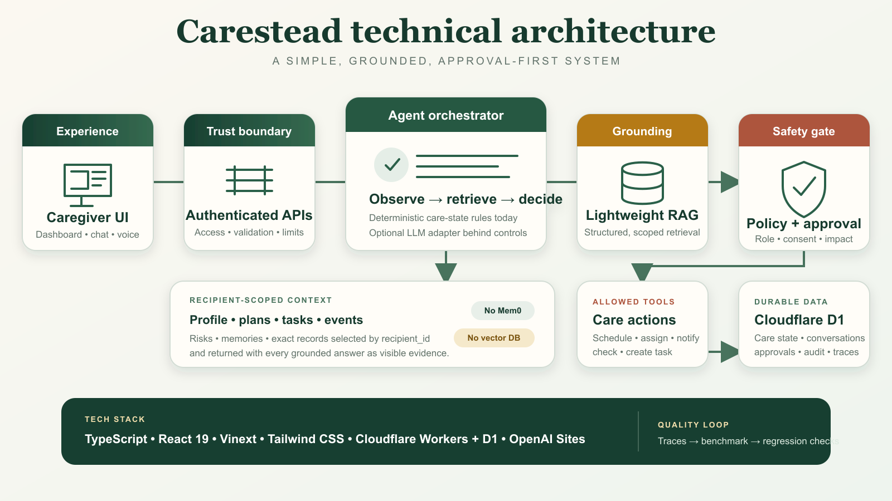

# Carestead

Carestead is a caregiver cognitive-load agent. It keeps a care recipient’s plan, responsibilities, schedule, trusted information, contacts, and recent activity in one place; detects coordination risks; answers questions with visible evidence; and requires caregiver approval before consequential actions.

Carestead supports care coordination only. It does not diagnose, prescribe, replace clinical judgment, or replace emergency services.



## Why Carestead

Caregiving is not one task—it is the ongoing work of remembering what changed, who owns the next step, which information is current, and what could fall through the cracks. Carestead maintains one recipient-scoped operational picture so caregivers can move from “What am I missing?” to “What needs attention?” and “What should happen next?”

## Core product features

| Product area | What it provides |
| --- | --- |
| **Accounts and access** | Sign-up, sign-in, sign-out, password recovery, recipient switching, and recipient-specific owner, caregiver, and viewer permissions. |
| **Care recipient and profile** | An isolated profile for each person, including care context, preferences, access notes, key contacts, key people, and support systems. |
| **Care plan and templates** | Reusable, versioned plans that can be personalized, safely cloned, and applied to another person without copying private history. An AI builder can propose responsibilities and clarification questions from the selected recipient’s profile. |
| **Responsibilities and Care Organizer** | Assignment, duration, dependencies, recurring care, visit preparation, workload forecasting, break coverage, shared availability, free-form update organization, and what-if planning. |
| **Care Circle and intelligent handover** | Recipient-specific roles plus a concise live handover and an on-demand AI brief of current state, risks, priorities, changes, contacts, and supporting evidence. |
| **Calendar, integrations, and timeline** | Google Calendar connection and approval-gated appointment changes, configurable delivery integrations, and a chronological record of actions and outcomes. |
| **Grounded chat and voice** | A model-backed copilot answers recipient-specific questions from visible evidence, with microphone input and spoken replies where the browser supports them. Raw audio is not stored. |
| **Approval-aware actions and notifications** | Chat and product workflows can prepare rescheduling, assignment, task, notification, and care-check actions. Authorized caregivers review the exact proposal before execution or external delivery. |
| **Risk checks and memory** | Explainable coordination-risk rules and durable, source-linked facts with verification and review status. |
| **Privacy and evaluation** | Consent, recipient access, retention, export, deletion, audit history, rate limiting, accessibility checks, and trajectory-level evaluation. |
| **Document and image intake** | Transiently analyzes a consented PDF, image, or text file for explicit dates, contacts, follow-ups, task drafts, and source-linked facts. Extracted facts remain unverified until caregiver review. |

## Agent capabilities

Carestead uses language understanding where it helps while keeping authorization, scheduling feasibility, approvals, and writes deterministic.

| Workflow | What the model contributes | Product control | AI pattern |
| --- | --- | --- | --- |
| **Grounded care chat** | Answers questions from the selected recipient’s current profile, responsibilities, memories, contacts, risks, and recent activity, with evidence references. | Recipient-scoped retrieval and evidence-ID validation prevent unsupported or cross-recipient answers. | **Hybrid agentic workflow:** the orchestrator retrieves evidence and controls actions; the LLM performs grounded synthesis. |
| **Care-update extraction** | Turns a spoken, typed, or pasted update into editable responsibility drafts. | The caregiver confirms missing details and prepares the selected drafts for approval. A deterministic extractor remains available as fallback. | **LLM extraction in an approval workflow:** the model structures language; deterministic code validates and applies approved drafts. |
| **Intelligent handover** | Produces a concise brief of current state, recent changes, priorities, risks, and supporting evidence. | The live structured handover remains the source of truth; the generated brief does not change care data. | **Grounded LLM synthesis:** retrieval and evidence validation surround a read-only summarization step. |
| **Conflict resolution** | Ranks and explains workable scheduling choices. | Candidate times are generated and revalidated by the deterministic scheduler. The user selects and previews an option before preparing it for approval. | **Hybrid agentic workflow:** deterministic tools generate and verify options; the LLM ranks and explains them. |
| **Adaptive care-plan builder** | Proposes a reusable set of responsibilities and clarification questions from the recipient profile and caregiver description. | Drafts are editable, another recipient’s private history is never copied, and nothing is applied without approval. | **LLM planning assistant:** the model proposes a structured plan while the orchestrator enforces isolation, validation, and approval. |
| **Communication composer** | Drafts recipient-grounded SMS, family, formal, calendar, or response-style messages. | The caregiver chooses the recipient and channel, edits the exact text, and approves delivery through existing notification controls. | **LLM drafting in an agentic delivery flow:** the model writes the draft; deterministic services control audience, channel, approval, and delivery. |
| **Document and image intake** | Extracts explicit dates, follow-ups, contacts, task drafts, and facts from PDF, TXT, PNG, JPG, or WebP files. | Processing requires consent, the source file is not retained, uncertain details are surfaced, and extracted facts remain unverified. | **Multimodal LLM extraction:** the model reads the source; deterministic controls govern consent, validation, verification state, and persistence. |

## Product walkthrough

The screenshots below use synthetic demonstration data.

### Reusable care plans

Caregivers can start with a built-in plan, personalize its responsibilities, save a de-identified template, or clone the plan structure for another person. Recipient history, memories, approvals, and past outcomes remain isolated.



### Grounded chat with voice controls

Ask Carestead answers from the selected recipient’s current profile and care state. The microphone starts browser speech recognition, spoken replies can be enabled separately, and only transcript text is retained.



### Appointment rescheduling with caregiver approval

An appointment request becomes a typed proposal. Carestead shows the intended change and supporting evidence, but no write occurs until an authorized caregiver approves it.



### Validated conflict resolution and reviewable plans

The **What if?** workflow checks a proposed move and its dependent responsibilities against the live care plan and shared availability. **Suggest workable options** starts with deterministically feasible times; AI ranks and explains those candidates when available, and a deterministic explanation keeps the workflow usable if the model does not return safe choices. A caregiver selects an option, previews the ripple effect, and prepares it for approval. The resulting **Reviewable plans** queue appears immediately below the active planning workflow.

Preparing the same change repeatedly reuses its pending proposal instead of creating duplicate approvals. When one scheduling proposal is applied, overlapping pending alternatives are retired while their history remains available for audit.



### Multi-channel notifications

Caregivers can choose a message template, select a receiving care-circle member, and prepare notifications for the Carestead inbox, mobile push, email, SMS, or browser push. Each selected channel gets its own approval draft; external delivery requires the channel to be configured and the receiving caregiver’s settings to allow it.



### Document and image intake

The intake workflow accepts PDF, TXT, PNG, JPG, and WebP files up to 5 MB. It extracts only explicit information, shows warnings and clarification questions, and lets the caregiver edit or remove every proposed responsibility and fact before preparing an approval.



This synthetic appointment notice illustrates the kind of explicit dates, contact details, follow-ups, and uncertainty the intake workflow can identify for caregiver review.



## How the agent works

Carestead uses one hybrid care-state agent rather than a group of unconstrained agents. The model handles language understanding and grounded synthesis; deterministic code owns authorization, validation, risk rules, approvals, tool execution, and fallback behavior.

1. **Observe:** receive a question, risk signal, or requested action for the selected recipient.
2. **Retrieve:** load only that recipient’s relevant profile, tasks, events, trusted facts, risks, contacts, approvals, and recent traces.
3. **Decide:** determine whether the evidence is sufficient and whether the request needs an answer or an action.
4. **Constrain:** apply role, consent, validation, impact, and approval rules outside the model.
5. **Act:** execute only an allowed, recipient-scoped tool after any required caregiver approval.
6. **Verify and record:** observe the result and save the evidence, decision, policy, tool, action, and outcome trace.



## Architecture

The caregiver experience calls authenticated server routes that enforce identity, recipient-level access, consent, validation, and rate limits. The orchestrator retrieves structured, recipient-scoped records from Cloudflare D1, evaluates the current care state, and produces either a grounded answer or a constrained action proposal. Consequential writes pass through the policy and caregiver-approval gate. Approved tools update operational data, and every result is written to the audit and evaluation trail.



### Key components

| Component | Responsibility |
| --- | --- |
| **Caregiver experience** | Account access, dashboard, recipient switcher, profile, plans, responsibilities, organizer, calendar, timeline, handover, Care Circle, integrations, notifications, privacy controls, chat, and voice. |
| **Authenticated API boundary** | D1-backed sessions, password protection and recovery, recipient authorization, consent, origin checks, input validation, throttling, and privacy-safe errors. |
| **Agent orchestrator** | Coordinates model-backed language tasks, retrieval, evidence validation, deterministic risk evaluation, action selection, approval policy, and trace recording. |
| **Lightweight RAG** | Retrieves exact structured records by authorized `recipient_id` and returns those records as visible evidence. |
| **Policy and approval gate** | Prevents prohibited, unauthorized, or unapproved consequential actions. |
| **Care tools** | Manage responsibilities, scheduling, assignments, notifications, trusted facts, profiles, handovers, and care checks. |
| **Cloudflare D1** | Stores recipient care state, conversations, approvals, audit entries, notifications, and evaluation traces. |

### Why lightweight RAG

The important MVP information is already structured, attributable, and time-sensitive. Carestead therefore retrieves exact rows from D1 instead of relying on a separate vector index. Every query is filtered by an authorized recipient identifier. The model receives compact records with stable evidence IDs, and its citations are rejected if they do not map back to those records.

### Agent tool surface

The model works through narrow logical tool contracts; direct write tools are deliberately unavailable. Each proposal passes through server-side authorization, consent, validation, and caregiver approval before an existing execution service may change data or contact anyone.

| Workflow | Read and proposal tools | Execution boundary |
| --- | --- | --- |
| **Grounded care chat** | `retrieve_care_context`, `answer_with_evidence`, `propose_care_action` | Answers must cite retrieved recipient records. Any requested write becomes a separate approval card. |
| **Care-update extraction** | `extract_care_update`, `propose_responsibility_bundle`, `request_clarification` | Drafts remain editable and do not enter the care plan until approved. |
| **Intelligent handover** | `get_recipient_profile`, `get_recent_changes`, `get_open_risks`, `compose_handover_brief` | The generated brief is read-only and links back to the live structured state. |
| **Conflict resolution** | `get_calendar_conflicts`, `get_care_circle_availability`, `simulate_care_plan`, `propose_calendar_change` | The deterministic scheduler rejects infeasible options; an approved proposal uses the existing calendar/planning service. |
| **Adaptive care plan** | `get_recipient_profile`, `get_plan_template`, `propose_template_adaptation`, `request_clarification` | Responsibilities become a reviewable bundle; another person’s history is never copied. |
| **Communication composer** | `get_verified_outcome`, `get_care_circle_member`, `draft_notification` | AI fills a draft only. Existing channel-specific approval and delivery controls send it. |
| **Document and image intake** | `analyze_document`, `propose_responsibility_bundle`, `propose_trusted_fact`, `request_clarification` | The source file is not retained. Approved facts enter D1 as `review_due`, not verified. |

## Tech stack

| Layer | Technology |
| --- | --- |
| **Frontend** | TypeScript, React 19, Vinext, Tailwind CSS |
| **Backend** | Vinext server routes on Cloudflare Workers |
| **Database** | Cloudflare D1 with Drizzle ORM |
| **Agent** | OpenAI Responses API with strict JSON Schema outputs, plus a deterministic TypeScript orchestrator and fallback |
| **Retrieval** | Recipient-scoped structured retrieval from D1 |
| **Voice** | Browser speech recognition and speech synthesis; transcript-only retention |
| **Authentication** | D1-backed accounts and hashed sessions, scrypt password hashing, password recovery, origin checks, and server-enforced recipient roles |
| **Testing** | Playwright, axe-core, synthetic benchmark runner, GitHub Actions |
| **Hosting** | OpenAI Sites and Cloudflare infrastructure |

Set `OPENAI_API_KEY` in `web/.dev.vars` for model-backed chat, care-update extraction, handover briefs, conflict alternatives, adaptive care plans, communication drafts, and document intake. `OPENAI_MODEL` defaults to `gpt-5.6-terra`, and `OPENAI_REASONING_EFFORT` defaults to `low`. Model requests use `store: false`. Existing risk checks, simulations, and fallback summaries remain deterministic; explicitly generative workflows report model unavailability instead of pretending a model result was produced.

For conflict resolution, the model never invents executable times: it receives a bounded list from the scheduling engine, and each returned option is simulated again before display. If the model response is unavailable or unusable, Carestead presents validated deterministic options instead.

## Memory, access, and safety

- Long-term memory is limited to explicit, source-linked facts stored in D1. Facts can be reviewed, verified, corrected, or archived.
- Every operational record is scoped to one care recipient. Owners, caregivers, and viewers receive different server-enforced permissions.
- Consequential actions require explicit approval; rejection or timeout produces no change.
- Consent withdrawal pauses care-record mutations, chat, voice, checks, and notifications.
- Owners can export recipient data or use a verified permanent-deletion workflow.
- External notification delivery requires configured providers, the receiving caregiver’s channel settings, and approval of the notification draft.

## Evaluation strategy

The checked-in benchmark contains 16 synthetic caregiving scenarios covering medication coordination, appointments, transportation, household needs, memory quality, and robustness. Each scenario has known expected evidence, severity, approval policy, action class, and outcome.

Carestead scores the full trajectory:

- **Retrieval:** Did the agent use the correct recipient-scoped evidence?
- **Decision:** Did it identify the correct risk or need for clarification?
- **Policy:** Did it apply access and approval rules correctly?
- **Tool selection:** Did it choose an allowed action that matched the scenario?
- **Outcome:** Did it verify success or report failure honestly?

Run the benchmark with:

```bash
cd web
npm run benchmark
```

Accessibility and browser workflow checks cover the main product surfaces, grounded chat, and approval-gated execution:

```bash
cd web
npm run test:accessibility
```

Benchmark details are available in [`web/benchmark/README.md`](web/benchmark/README.md).

## Run locally

Requirements: Node.js 22.13 or newer.

```bash
cd web
npm install
npm run dev
```

The development application creates and seeds its D1 tables on first use. After schema changes, generate a checked-in migration with `npm run db:generate`.

To enable model-backed capabilities locally, copy the example runtime configuration and add a development key:

```bash
cd web
cp .dev.vars.example .dev.vars
# Set OPENAI_API_KEY in .dev.vars; do not commit that file.
npm run dev
```

## Current scope

Carestead is a care-coordination prototype, not a clinical decision system. It does not make diagnoses, recommend medication changes, determine whether a situation is medically safe, or independently contact people or providers. High-impact actions remain under human control and visible in the activity and evaluation history.
