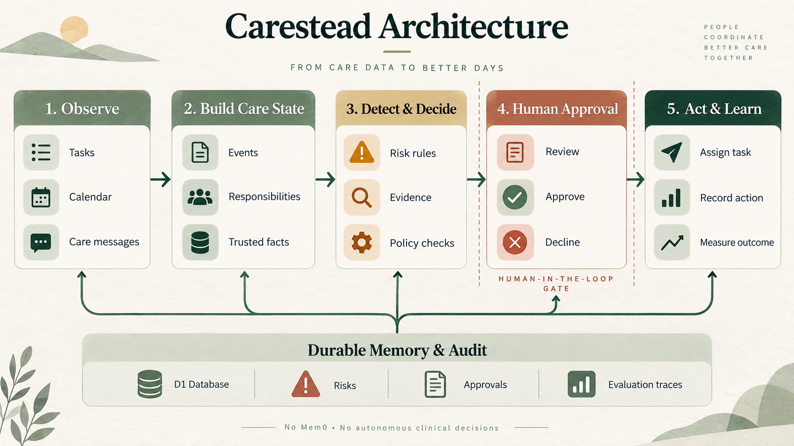

# Carestead

Carestead is a caregiver cognitive-load agent that monitors a changing care plan, identifies coordination risks, proposes constrained actions, and records an evaluation trace for every decision.

## Product capabilities

- Shared responsibilities with owners, deadlines, and completion state
- Explainable risk detection across tasks, timeline events, and trusted facts
- Human approval before consequential actions
- Structured, source-linked memory stored in the application database
- Evaluation traces for evidence, decisions, policy checks, tool use, and outcome
- Synthetic longitudinal demo data for safe testing

## Architecture

The MVP is a Sites/Vinext React application backed by Cloudflare D1. The agent layer is deliberately deterministic for the initial release: it evaluates structured records with testable rules and keeps each result auditable. No Mem0 service is required. An LLM reasoning adapter can be introduced later behind explicit consent, redaction, and the same approval policy.



```text
Caregiver dashboard
       │
       ▼
API action layer ─── human approval gate
       │
       ├── care-state risk rules
       ├── responsibility tools
       └── evaluation trace writer
       │
       ▼
Cloudflare D1
tasks · events · risks · memories · approvals · traces
```

## Agent decision path

The agent retrieves relevant records, checks whether the evidence is sufficient, evaluates risk, and routes consequential actions through a caregiver approval gate. Each path ends in a recorded, scoreable outcome.


## Run locally

```bash
cd web
npm install
npm run dev
```

The application creates and seeds its D1 tables on first use. To create a checked-in SQL migration after schema changes, run `npm run db:generate`.

## Safety scope

This is a care-coordination prototype, not a clinical decision system. It does not diagnose, prescribe, or independently contact people or providers. High-impact actions require caregiver approval and remain visible in the event and evaluation history.
