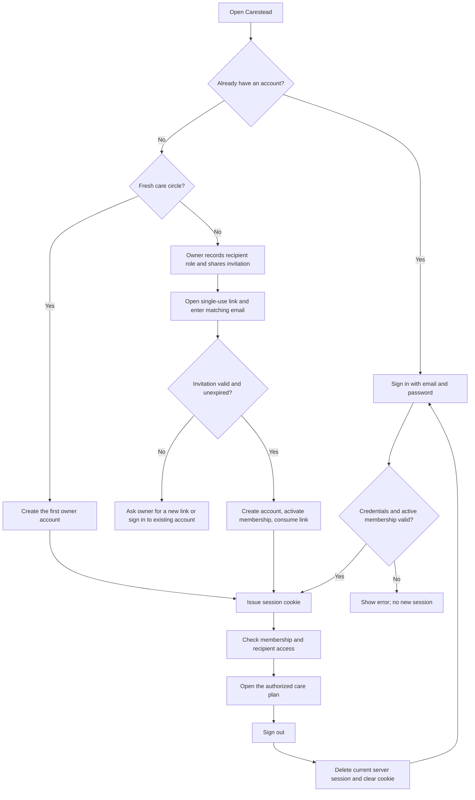

# Accounts, sign-in, and care-circle access

Carestead uses email/password accounts backed by Cloudflare D1. Each deployment currently has one shared care circle, with separate access roles for each care recipient. Creating an account does not create an independent household.

[Project overview](../README.md) · [Architecture diagram](images/carestead-technical-architecture.svg) · [Caregiver journey](images/carestead-user-journey.svg)

## First account

1. Start the app using the [local setup instructions](../README.md#run-locally) and open `/sign-up`.
2. Enter your name, email, password, and matching password confirmation. Passwords must contain 12–128 characters; email addresses are trimmed and lowercased.
3. Select **Create account**. On a fresh database, this account becomes the care-circle owner and receives a session immediately.
4. The dashboard opens with the seeded synthetic care plan. Select the relevant recipient before inviting others or changing care records.

Both pages use the dashboard’s theme tokens, DM Sans body font, Manrope headings, and shared Button/Input components. Password fields start masked. Each eye button independently shows or hides its field, preserves the entered value, and exposes an accessible Show/Hide label. Password confirmation appears only on sign-up.

## Guest preview

Select **Continue as guest** on `/sign-in` or `/sign-up` to explore a read-only sample dashboard without creating an account. Invitation links keep the invited account flow. The preview contains fictional data independent of the deployment’s care records, with Overview, Responsibilities, Timeline, Care plan, and Evaluations.

Guest sessions use the same HttpOnly cookie, seven-day expiry, and sign-out revocation as account sessions. They do not create accounts or memberships, claim the first owner slot, or grant access to private care APIs. Sign out to create an account or sign in. Connected features require a care-circle account.

`POST /api/auth/guest` requires a matching Origin, uses the authentication IP rate limit, and returns `{ "ok": true }` with a session cookie. Existing valid sessions are preserved. Guest `/api/auth/session` responses include `isGuest: true`; `/api/state` returns only the sample plan. Other recipient requests and protected features return `403`.

## Invite another person

1. As an owner, choose the recipient, then open **Care circle → Invite member**.
2. Enter the person’s name and email, and choose **Caregiver** or **Viewer**.
3. Select **Record invitation**, then copy the link from **Share the invitation** and send it privately to that person. Carestead does not send an invitation email.
4. The person opens the link and creates an account using the exact invited email address, normalized without case sensitivity. If another account is already signed in on that browser, sign out first or use a separate browser profile.
5. Successful sign-up activates the membership and consumes the invitation. It grants the recipient role selected by the owner.

An invitation expires after seven days and can be used once. **New invite link** replaces a pending member’s link and invalidates the previous one. A bare email match does not activate a membership. An existing active account added to another recipient uses its current credentials; no second sign-up is needed.



## Returning users and sign-out

Open `/sign-in`, enter your email and password, and select **Sign in**. A successful sign-in opens `/`; visiting either authentication page with a valid session also redirects to `/`.

Sessions survive page reloads and expire seven days after issuance. The expiry is fixed, not extended by ordinary page activity. A missing, malformed, revoked, or expired session cannot access protected care APIs. The dashboard redirects to `/sign-in` when its state request returns `401`.

**Sign out** in the dashboard header deletes the current server session, clears its cookie, and returns to `/sign-in`. It does not sign out other devices. A valid account session alone is insufficient for care data: active care-circle membership and recipient access are checked separately.

## Request and authorization flow

```mermaid
sequenceDiagram
    actor Person as Caregiver
    participant UI as Sign-in page
    participant API as Authentication API
    participant DB as D1
    participant Care as Care API
    Person->>UI: Enter email and password
    UI->>API: POST /api/auth/sign-in (JSON, matching Origin)
    API->>DB: Check rate limits and find account
    API->>API: Verify salted scrypt password hash
    API->>DB: Require active membership
    alt Invalid credentials or inactive membership
        API-->>UI: 401 or 403; show error
    else Allowed
        API->>DB: Store session token hash and expiry
        API-->>UI: 200 with HttpOnly session cookie
        UI->>Care: GET /api/state with cookie
        Care->>DB: Validate session, membership, and recipient role
        Care-->>UI: Authorized recipient state
        Person->>UI: Sign out from dashboard
        UI->>API: POST /api/auth/sign-out
        API->>DB: Delete current session token hash
        API-->>UI: Clear cookie; return to sign-in
    end
```

For care-record writes, the API also checks Origin, role, consent, validation, throttling, and any applicable approval requirement. A viewer can inspect authorized care records but cannot perform caregiver writes. Sign-up does not replace the consent acknowledgements required when creating a care recipient.

## API reference

Authentication is implemented in [`web/app/api/auth/[action]/route.ts`](../web/app/api/auth/%5Baction%5D/route.ts). Authentication POST requests require an `Origin` matching the request URL’s origin; `Sec-Fetch-Site: cross-site` is rejected. Sign-in and sign-up use `Content-Type: application/json`. Successful account operations set the cookie through `Set-Cookie`, rather than returning the session token in JSON.

| Method and route | Request | Success |
| --- | --- | --- |
| `POST /api/auth/sign-up` | `displayName`, `email`, `password`, `confirmPassword`; `invitation` for an invited account | `201`, `{ "ok": true }`, session cookie |
| `POST /api/auth/sign-in` | `email`, `password` | `200`, `{ "ok": true }`, session cookie |
| `GET /api/auth/session` | Session cookie | `200`, `{ "user": { "id", "email", "displayName" } }`; absent/invalid session returns `401`, `{ "user": null }` |
| `POST /api/auth/sign-out` | Current cookie; no JSON body required | `200`, `{ "ok": true }`, cleared cookie |
| `POST /api/state`, action `invite_member` | Owner session; `recipientId`, `email`, `displayName`, `role` | Updated state plus `invitationUrl` for a pending account, or `null` for an existing active account |
| `POST /api/state`, action `renew_invitation` | Owner session; `recipientId`, member `id` | Updated state plus replacement `invitationUrl` |

The returned invitation URL has the form `/sign-up#invitation=<token>`. The fragment stays out of page request URLs and referrer headers; the form sends the token in the sign-up JSON body. Treat the complete link as a secret. Authentication responses and invitation-link responses use `Cache-Control: no-store`.

| Status | Meaning and next step |
| --- | --- |
| `400` | Invalid form data, short password, mismatched confirmation, or malformed invitation. Correct the form or request a new link. |
| `401` | Incorrect email/password, or absent/invalid session. Sign in again; the credential error does not identify which field was wrong. |
| `403` | Origin rejected, inactive membership, or insufficient recipient permissions. Use the app’s own origin or contact the owner. |
| `409` | Sign-up unavailable: account already exists, invitation cannot be used, or a later account tried to sign up without an invitation. Sign in or ask for a new link. |
| `429` | Too many attempts. Wait for the applicable rate-limit window before retrying. |

The `/api/auth/session` response describes the account identity, not its recipient permissions. Inspect the care API’s authorization result for access to a particular recipient.

## Storage and security implementation

| Table | Stored data | Relationship |
| --- | --- | --- |
| `auth_accounts` | Account ID, unique normalized email, display name, password hash, creation time | Account ID is linked through `care_circle_members.user_id` |
| `auth_sessions` | SHA-256 token hash, account ID, expiry | Multiple sessions can belong to one account |
| `auth_invitations` | Member ID, unique SHA-256 token hash, expiry | One current invitation per pending member |
| `care_circle_members` | Member identity, activation status, care-circle role | Links account to care-circle membership |
| `recipient_members` | Recipient ID, member ID, access role | Defines per-recipient authorization |

[`sessions.ts`](../web/lib/sessions.ts) uses a random 16-byte salt and scrypt (`N=32768`, `r=8`, `p=3`, 64-byte output) for password hashing, with constant-time hash comparison. Session and invitation tokens each use 32 random bytes; only their SHA-256 hashes are stored. The `carestead_session` cookie is HttpOnly, SameSite=Lax, scoped to `/`, and Secure when the request URL uses HTTPS.

Account creation and invitation consumption use a D1 batch with conditional SQL, preventing repeated use of the same link. New sign-in sessions replace the session presented by that request and clean up expired sessions. Passwords and confirmation values are not stored in care-state records or audit entries.

[`guardrails.ts`](../web/lib/guardrails.ts) applies a shared sign-in/sign-up budget of 10 attempts per email and 40 per client IP within 15 minutes. IP grouping uses `cf-connecting-ip`; without that header, requests share a `local` bucket. Invitation creation and renewal each permit 10 requests per actor per hour. Successful authentication attempts also count toward their limits.

Schema bootstrap creates the tables on first use. The checked-in [authentication migration](../web/drizzle/0007_dapper_tarot.sql) mirrors the [Drizzle schema](../web/db/schema.ts).

## Local setup, migration, and current limits

- Local development requires no auth-provider API key. Run the app, then create an account; automatic demo login is removed.
- For the legacy development database, first sign-up can replace the active owner `local-demo-owner` only on `localhost` or `127.0.0.1`, outside production, when there are no password accounts and no other non-null member user IDs. Existing recipient links and pending invitations are retained. Renew older pending invitations to obtain usable sign-up links.
- Existing real Site identities are not automatically converted or claimed by email. Those deployments need an administrator-assisted migration; this version does not provide a migration UI or a self-service account-claim endpoint. Preserve existing data when planning that migration.
- `oai-authenticated-user-*` and `x-carestead-test-user-*` headers no longer authenticate care API requests. Any host-level access gate is separate from the Carestead account session.
- Password reset/change, email delivery, general email verification, MFA, social sign-in, and a “sign out all devices” control are not implemented. Invitation possession plus matching email controls invited enrollment; it is not a general mailbox-verification service.

## Verification and implementation map

From `web/`, run:

```bash
npx tsc --noEmit --incremental false
npm run build
npm run test:accessibility
```

Playwright starts an isolated server on port 43179 with an ephemeral D1 database. Its setup creates the first owner through the actual sign-up form. The suite exercises invited enrollment, wrong-email and reused-link rejection, password visibility, incorrect credentials, viewer write denial, session persistence, sign-out revocation, rejection of identity-header bypasses, mobile layout, authentication-page accessibility, and the existing dashboard/chat workflows. It is regression coverage, not an exhaustive security assessment.

| Source | Responsibility |
| --- | --- |
| [`app/sign-in/page.tsx`](../web/app/sign-in/page.tsx), [`app/sign-up/page.tsx`](../web/app/sign-up/page.tsx) | Page routes |
| [`components/auth-form.tsx`](../web/components/auth-form.tsx) | Shared form, validation messages, independent eye controls, redirects |
| [`lib/sessions.ts`](../web/lib/sessions.ts) | Password hashing, cookies, session creation, invitation tokens, Origin checks |
| [`lib/auth.ts`](../web/lib/auth.ts) | Session identity and active membership checks |
| [`app/api/state/route.ts`](../web/app/api/state/route.ts) | Owner invitation actions and recipient authorization |
| [`tests/auth.setup.ts`](../web/tests/auth.setup.ts), [`tests/auth.spec.ts`](../web/tests/auth.spec.ts) | Account setup and browser regression coverage |
