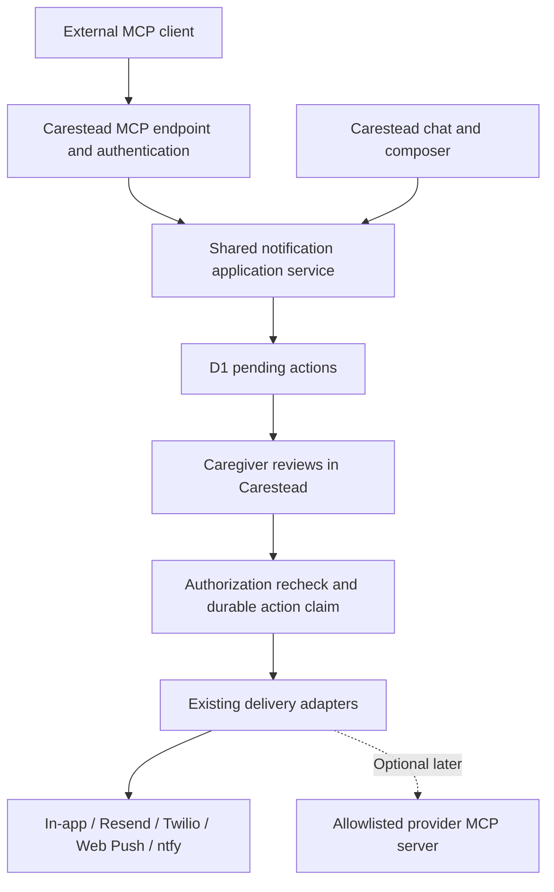

# MCP notifications implementation plan

Status: recommendation; no runtime implementation. Reviewed September 12, 2026 against the current working tree, including uncommitted notification changes.

## Recommendation

Build one Carestead MCP server exposing notification discovery, draft preparation, and delivery status. Reuse the existing five delivery channels and require approval in Carestead before sending. Add outbound connections to provider MCP servers only when they provide a needed capability.

This addresses two possible meanings of “multiple notification tools”: one MCP server can expose several notification operations, and a single preparation operation can select multiple delivery channels. Multiple provider MCP servers are also possible, but are a separate integration layer.

MCP standardizes tool access; its protocol notifications are not caregiver messages, and it does not supply delivery, retries, or approval enforcement automatically.

## Existing implementation

| Area | Finding |
| --- | --- |
| Channels | `web/lib/notification-types.ts` defines `in_app`, `email` (Resend), `sms` (Twilio), `push` (Web Push), and `ntfy`. |
| Multiple channels | `prepareNotifications()` in `web/lib/notification-service.ts` already accepts `channels[]`, rejects duplicates, and validates every destination before returning individual proposals. |
| Tool schema | `sendNotificationTool` advertises a single `channel`. It is a function-tool definition, not an MCP endpoint. |
| Approval | `web/app/api/chat/route.ts` persists drafts, scopes actions to a member's thread, and executes approved actions under a recipient lease. |
| UI | `web/components/notification-composer.tsx` already supports multiple drafts and sequential “approve all”. |
| Delivery | `executeNotification()` rechecks membership, consent, opt-in, and destination fingerprints, then claims a unique delivery row for each action. External sends also produce an in-app copy. |
| Configuration | `effectiveIntegrations()` resolves saved configuration and removes credentials for disabled integrations. |
| Agent | `web/agent/orchestrator.ts` runs deterministic care-state evaluation. Notification planning currently lives in the chat route. |
| Runtime | Cloudflare Workers, Vinext, and D1; no MCP SDK dependency in `web/package.json`. |

Two gaps matter when exposing this to external clients: draft persistence currently loops over proposals rather than committing the whole batch atomically; repeated proposal requests can create fresh approval identities even though repeat approval of one action cannot send twice.

## Architecture choices

| Option | Benefit | Cost | Recommendation |
| --- | --- | --- | --- |
| Carestead MCP server over existing services | Exposes all five channels through one policy and audit path | New endpoint, shared service extraction, delegated authentication | Start here |
| Carestead as client of provider MCP servers | Accesses provider tools through a common protocol | Provider-specific auth, tool mapping, receipt handling, and failure semantics | Optional later |
| Existing HTTP tools only | Already supports multiple channels | No interoperability with MCP clients | Sufficient if multichannel delivery is the only goal |

Proposed flow:



Keep internal calls in-process. The web app does not need to call its own MCP server, and an LLM is not required for this implementation.

## Proposed MCP contract

| Tool | Input | Result and permissions |
| --- | --- | --- |
| `list_notification_targets` | `recipientId` | Authorized active member IDs and display names; no raw delivery destinations |
| `list_notification_channels` | `recipientId`, `memberId` | Available channels and safe explanations for unavailable ones; account for integration enablement and member opt-in |
| `prepare_notifications` | `recipientId`, `memberId`, `channels[]`, `title`, `detail`, `requestKey` | Pending batch ID, action IDs, channel summaries, and a Carestead review URL; no delivery |
| `get_notification_status` | `recipientId`, `batchId` | Authorized per-channel proposal and delivery states; no credentials, push subscription material, or ntfy topics |

Keep one preparation tool with an explicit channel enum. Five separate `prepare_email`/`prepare_sms` tools would duplicate schema and routing rules; thin aliases could be added if a client needs them.

Example preparation arguments:

```json
{
  "recipientId": "recipient-alex",
  "memberId": "member-maya",
  "channels": ["email", "ntfy"],
  "title": "Caregiver update",
  "detail": "Please review the care plan in Carestead.",
  "requestKey": "client-generated-unique-request-id"
}
```

Return `pending_approval`, not “sent”. Bind drafts to the authenticated caregiver's existing thread so they can review them in the app. The review URL must require sign-in and must not act as an approval token. Do not expose an approval or direct-send MCP tool in the first release; a model must not be able to approve its own proposal.

## Implementation sequence

### 1. Extract shared notification application operations

- Add `web/lib/notification-actions.ts` for scoped draft creation, status queries, and approval orchestration. Move the relevant operations out of the chat route without moving unrelated care actions.
- Preserve membership checks, actor/thread ownership, active consent, rate limits, audit/trace entries, effective integration settings, and the recipient lease. Calling `executeNotification()` alone would omit protections currently implemented by its caller.
- Keep provider code in `notification-service.ts` initially. A provider registry is useful when adding outbound MCP, but is not a prerequisite for an inbound server.
- Share validation across the HTTP and MCP interfaces. Preserve the existing single-channel function contract; add a versioned multichannel contract rather than silently changing its required arguments.

Completion: existing notification and chat tests pass; proposals never invoke a provider; HTTP behavior remains compatible.

### 2. Add durable batch preparation

- Add a D1 migration for notification batches with actor, recipient, client identity, request key, canonical payload hash, and creation time, plus a batch-to-action mapping.
- Uniquely scope the request key to the authenticated client, actor, and recipient. The same key and payload return the same batch; the same key with different content returns a conflict.
- Validate all channels first, then atomically persist the batch, child actions, messages, and proposal audit entries. Handle simultaneous identical requests by returning the winning batch.
- Keep one action and delivery claim per channel. Batch approval is not atomic external delivery: email can be accepted while SMS fails.
- Extend deletion, export, and retention for new metadata. Preserve deduplication records through the accepted replay window; do not allow a stale request to recreate sends after its records expire.
- Define editing within a batch: retain the logical item but replace its action identity, invalidate the old approval, and show its revision. Replaying preparation returns the existing batch, never resurrects superseded text.

Completion: retrying a proposal creates no extra drafts; partial persistence rolls back; existing single-channel actions still work.

### 3. Add an authenticated MCP endpoint

- Prototype Streamable HTTP at `/api/mcp` using the supported Cloudflare MCP handler and compatible MCP SDK. Pin a tested package set and protocol version; do not mix SDK-generation examples. Cloudflare documents a stateless handler suitable for this starting point. Verify request handling and streaming in Vinext and deployed Workers before committing the integration. [Cloudflare handler API](https://developers.cloudflare.com/agents/model-context-protocol/apis/handler-api/)
- Keep request identity in request-scoped context; never share one authenticated user's server context with another request.
- Implement delegated OAuth through an established authorization component, including protected-resource metadata, audience validation, expiry/revocation, and scopes such as `notifications:read` and `notifications:prepare`. Map the authenticated subject to current Carestead membership on every call. Existing browser sessions do not by themselves provide remote MCP authorization. [MCP authorization specification](https://modelcontextprotocol.io/specification/2025-11-25/basic/authorization)
- Preserve browser origin/CSRF protection for existing cookie-authenticated routes. Add the MCP transport's own origin checks and bearer-token validation independently.
- Register explicit input/output schemas and sanitized tool errors. Tool descriptions and annotations communicate intent; server checks enforce it.
- Implement a sign-in-preserving review link that selects the recipient and batch in the composer.

Completion: an external client can discover tools, prepare two channel drafts, open their review screen, and read results after the caregiver approves them. Cross-recipient access and self-approval remain impossible through this surface.

### 4. Evaluate outbound provider MCP only if needed

Resend offers an official hosted MCP endpoint at `https://mcp.resend.com/mcp`, with email sending and broader account-management tools. It is a plausible pilot, but discover and allowlist only the required operations and verify that the send tool preserves the action idempotency key and usable provider receipts before replacing the direct adapter. [Resend MCP documentation](https://resend.com/docs/mcp-server)

Twilio's documented hosted MCP endpoint is currently a read-only documentation search/retrieval service. It cannot replace the existing SMS send call. Retain Twilio REST delivery unless a separately verified execution server is selected. [Twilio MCP documentation](https://www.twilio.com/docs/ai/mcp)

Keep ntfy and Web Push behind the existing adapters; a separate MCP server per channel is unnecessary. Cloudflare provides an outbound MCP client if another provider warrants one. [Cloudflare MCP client API](https://developers.cloudflare.com/agents/model-context-protocol/apis/client-api/)

If added, make outbound MCP an execution adapter behind approval. Allowlist servers and exact tools, resolve destinations server-side, store credentials separately from client tokens, validate results, and bound calls by time and response size. Treat provider tool descriptions/results as untrusted data. Record provider and transport metadata with attempts and bind a material transport/configuration change to a fresh review.

Completion: a mocked MCP send follows the same action claim, receipt, and failure rules as direct HTTP. An ambiguous MCP timeout never triggers an automatic resend through REST.

## Delivery behavior and validation

Keep explicit fan-out as the first release: send only on selected, approved channels. Do not add fallback, scheduling, or automatic retries in the MCP work. Each external channel currently creates an in-app copy; preserve and document that behavior initially, then consider one shared inbox entry per batch as a separate UX change.

Status responses must distinguish pending/rejected proposals from `posted`, `sending`, `accepted`, `failed`, and `unknown` delivery attempts. Acceptance is not confirmed receipt. If a request dies after a provider accepts it, leave the attempt uncertain until reconciled; MCP does not provide exactly-once delivery.

Extend the existing service and browser suites with:

- Same request replay, conflicting payload replay, simultaneous preparation, and interrupted batch persistence.
- Cross-member and cross-recipient access, expired/revoked tokens, incorrect audience, and missing scopes.
- Consent withdrawal, integration disablement, and destination changes between preparation and approval.
- Repeated/concurrent approval and edited/superseded draft approval.
- Mixed channel results, malformed MCP results, and a timeout after provider acceptance without fallback sends.
- MCP discovery and calls against local and deployed Workers using synthetic destinations and mocked providers.

An opted-in real-device/provider smoke test is a separate rollout step. No messages need to be sent during development verification.

## Suggested scope and effort

Rough planning estimates for one engineer, assuming familiarity with this codebase:

| Milestone | Estimate |
| --- | --- |
| Shared service extraction and atomic/idempotent batches | 2–3 days |
| MCP endpoint, tools, and review navigation | 1–2 days |
| OAuth integration and membership binding | 2–4 days; larger if no suitable authorization service exists |
| Integration tests and rollout validation | 1–2 days |
| Optional outbound provider MCP pilot | 1–3 additional days |

Start with phases 1–3 using in-app and ntfy for the demonstration, while exposing other configured and opted-in channels through the same contract. This makes MCP interoperability reviewable without replacing working delivery integrations.
