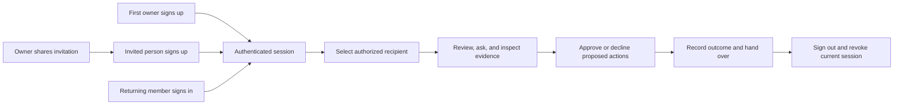

# Product workflows

[Back to Carestead](../README.md) · [Documentation index](README.md)

## Caregiver user journey

A first-time owner creates an account; other new caregivers join through an owner-issued invitation link. Returning users sign in, then select an authorized care recipient. A caregiver reviews the current state, asks a grounded question by text or voice, inspects the retrieved evidence, and explicitly approves or declines any consequential action. The resulting change and outcome remain visible to the next caregiver through the live handover and audit trail.

See the [account and invitation flow](authentication.md#invite-another-person) for enrollment checks and failure paths.
## Care-recipient and reusable-plan model

Each person has a durable care-recipient record and one active care plan. A plan points to a template key and version; edits to instantiated responsibilities are preserved as recipient-specific overrides. The product includes four starting points:

- Aging at Home
- Medication Support
- Post-Discharge: 30 Days
- Mobility & Physiotherapy

Creating a recipient instantiates fresh responsibilities from the latest selected template. Template upgrades are never automatic: the owner reviews and applies them, new responsibilities are added, and existing personal edits are not overwritten.

“Save as template” creates a reusable custom template from active responsibility structure. Person names are replaced and medication-specific responsibility text is normalized. “Clone plan” creates a new recipient with fresh, unassigned responsibilities. Neither operation copies memories, events, risks, approvals, traces, outcomes, or care-circle membership.

Operational tables remain compact and are connected to a person and plan through `record_scopes`. This provides one authorization and retrieval boundary across tasks, events, memory, risks, approvals, and agent traces.
## Caregiver handover brief

The **Handover** view is a live operational summary for moving responsibility from one caregiver to another. It combines:

- a concise profile, pronouns, home base, care context, communication preferences, mobility/access notes, and urgent-situation plan;
- the newest care event and its source;
- unresolved risks, pending approvals, facts requiring verification, and the next open responsibilities;
- key people, providers, and support services with phone/email details, priority, and operational notes; and
- the care-circle members who currently have access and their role.

Caregivers can copy the brief as plain text for a controlled handover, edit the profile, and create, edit, or archive support contacts. The brief is assembled from current recipient-scoped data whenever it loads, so it does not become a disconnected summary that silently goes stale. It remains a care-coordination aid rather than a medical record or source of clinical guidance.
## Responsibility and memory lifecycle

Caregivers can create, inspect, edit, and archive responsibilities. Responsibilities may also be reassigned, scheduled, marked due soon, completed, or reopened through editing.

Long-term memory uses explicit source-linked records. Chat can suggest a fact from a “Remember that…” request or a simple preference statement; caregiver approval confirms the exact wording and shares it with the selected recipient’s care circle. Approved chat facts are verified immediately. See [the memory pilot guide](memory-pilot.md) for optional Mem0 setup, data handling, and tests. Facts entered through the manual form begin in `review_due`, can be verified by a caregiver, corrected when inaccurate, and archived when obsolete. Archiving keeps the audit history while preventing the record from being used as active context.

## Planning and connected actions

See [care planning](care-planning.md) for coverage acceptance and simulations, [Care ahead](care-ahead.md) for forecasts and recurring care, [Calendar](google-calendar-setup.md) for reviewed invitations, and [notifications](notification-setup.md) for delivery channels and limits.
